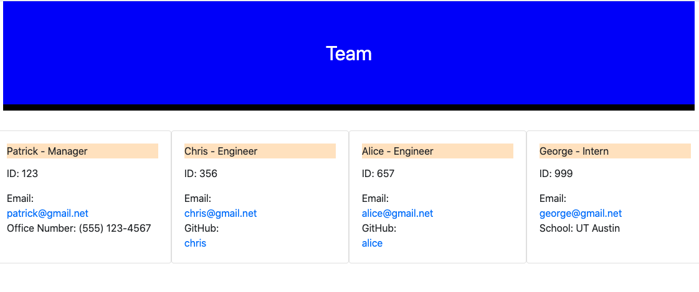

# Team-Profile-Generator by Russell Morgan

## Description
This week's challange was to generate a html file displaying a team; including the manager, one or more engineers and an intern. The employee information was inputed using inquirer.js and loops until you select done. Jest was used to test the different classes and Screencastify to produce a video.

## Installation
Download the project from the github link shown below.

## Usage
Run 'node index.js' from the terminal command line.

## Contributors
None.

## Tests
Tests were created using Jest and to run them; after cloning the code, enter 'npm run test' on the command line.

## GitHub link
https://github.com/rhmorganjr/team-profile-generator/tree/master

## Video Link

## HTML Screenshot

